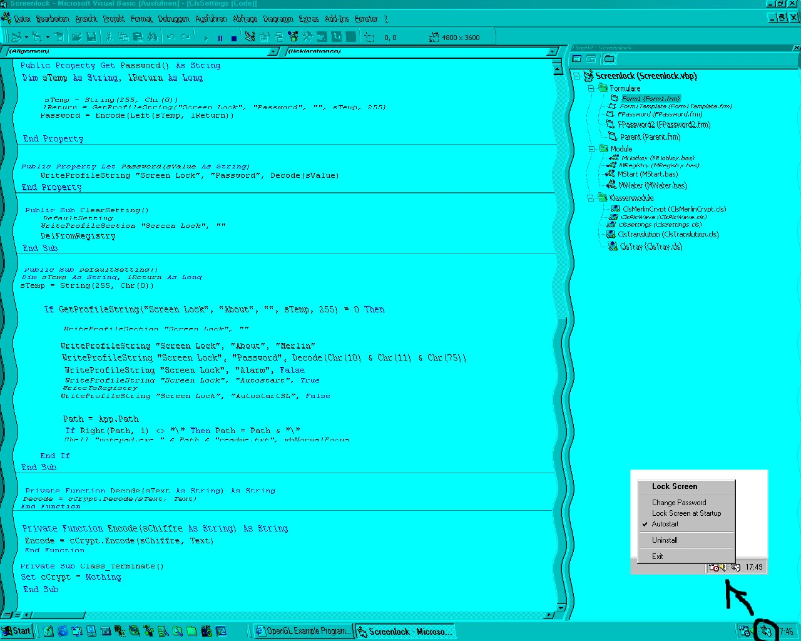



## Screen Lock \(Transparent Form with Wave Effect\)

### Description

This Program demonstrate various Functions. f.E. Transparent Form with Wave Effect, SysTray, Autostart (Registry, Win.ini), Cryptographie (Randomize Chiffretext by same Source,Bin Text Mode...), Hotkeys and more. Without Ocx or Dll also simple Api.
 
### More Info
 

             |
---                |---
**Submitted On**   |2001-05-16 18:48:24
**By**             |[\_\_merlin\_\_](https://github.com/Planet-Source-Code/PSCIndex/blob/master/ByAuthor/merlin.md)
**Level**          |Intermediate
**User Rating**    |4.8 (29 globes from 6 users)
**Compatibility**  |VB 5\.0, VB 6\.0
**Category**       |[Complete Applications](https://github.com/Planet-Source-Code/PSCIndex/blob/master/ByCategory/complete-applications__1-27.md)
**World**          |[Visual Basic](https://github.com/Planet-Source-Code/PSCIndex/blob/master/ByWorld/visual-basic.md)
**Archive File**   |[Screen Loc197025172001\.zip](https://github.com/Planet-Source-Code/merlin-screen-lock-transparent-form-with-wave-effect__1-23229/archive/master.zip)

